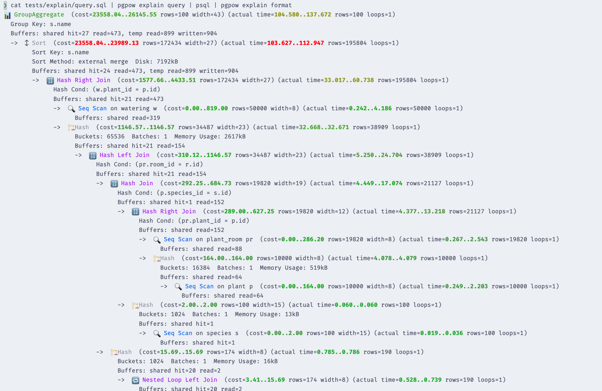

# pgpow

[](https://pypi.org/project/pgpow/)
[](https://github.com/robyoung/pgpow/releases)
[](https://github.com/robyoung/pgpow/actions/workflows/test.yml)
[](https://github.com/robyoung/pgpow/blob/master/LICENSE)

A command line toolkit for working with PostgreSQL.

## Installation

Install this tool using `pip`:
```bash
pip install pgpow
```

You can install completions for your shell using the [click instructions](https://click.palletsprojects.com/en/stable/shell-completion/).

## Usage

To see all available commands, run:
```bash
pgpow --help
```

### Queries

The `query` command contains a collection of useful queries that for various
tasks. The commands all return the queries on stdout so you can pipe them to
`psql` or another tool.

For example to see the 5 largest tables in your database:
```bash
pgpow query maintenance table-size --limit=5

    SELECT
      table_schema || '.' || table_name AS table_full_name,
      pg_size_pretty(pg_total_relation_size(quote_ident(table_schema) || '.' || quote_ident(table_name))) AS total_size
    FROM information_schema.tables
    WHERE table_type = 'BASE TABLE' AND table_schema NOT IN ('pg_catalog', 'information_schema')
    ORDER BY pg_total_relation_size(quote_ident(table_schema) || '.' || quote_ident(table_name)) DESC

LIMIT 5
```

Then to run the query in `psql`:
```bash
pgpow query maintenance table-size --limit=5 | psql -d your_database
```

The queries are grouped into categories:
- `activity`: Queries for monitoring database activity.
- `maintenance`: Queries for database maintenance and monitoring.
- `performance`: Queries for performance tuning and analysis.
- `statement`: Queries for analyzing `pg_stat_statements` data.

### Explain

The `explain` command helps you generate and format `EXPLAIN` statements.

To wrap your query in an `EXPLAIN` statement use:
```bash
cat query.sql | pgpow explain query
```

Then to format the output with colour highlighting use:
```bash
cat query.sql | pgpow explain query | psql -d your_database | pgpow explain format
```

This will produce output like:



## Development

This project uses [uv](https://docs.astral.sh/uv/) for development.

```bash
uv sync --dev
```

Run static analysis with:
```bash
uv run ruff check
uv run ruff format
uv run mypy .
```

Run tests with:
```bash
uv run pytest
```
